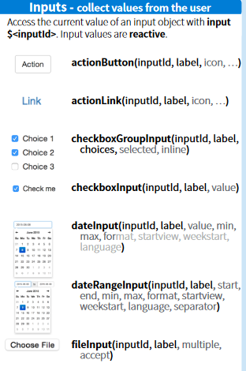

```{r setup, include=FALSE}
knitr::opts_chunk$set(echo = TRUE)
```

```{r include=FALSE}
library(tidyverse)
library(shiny)
library(shinythemes)
library(owmr)
```

# Shiny

## Whats Shiny?

- Shiny is an R package that makes it easy to build interactive web applications (apps) straight from R.
- Shiny applications will run on a server. 
- They will hosted right on your computer over an integrated service. 
- With this apps you can create interactive web applications for data visialization.
- With this apps you can create interactive markdown files for visualization


## App template for r.scripts

If you type in shinyApp as Snippet than you will get this shiny app template. Use this template in a r.script.

```{r}
#ui <- fluidPage()

#server <- function(input, output, session) {}

#shinyApp(ui, server)
```

## App template for r.markdown

Because we are here in a markdown file we have to use some other stuff called inline applications

```{r}
#shinyApp(  
#  ui = fluidPage(  ),

#  server = function(input, output) {  },

#  options = list(height = 500)
#)

```

# There are two meaningful parts of a shiny app

## ui = fluidPage ()

- This is the front-end of the application
- You can strukture the visual input/output
- You can enter input variables through widgets
- You declare what kind of output you want

## server = function(input, output) {}

- This is the back-end of the application
- Here you run your reactive functions
- a function with instructions on how  to build and rebuild the R objects displayed in the UI

## Do some front-end stuff

```{r}
#ui <- fluidPage(
  #App title
  #titlePanel("For the title"),
  #sidebarLayout(
    #sidebarPanel(
      #sliderInput(inputId = "bins",
                  #label = "Number of Bins:",
                  #min = 1,
                  #max = 50,
                  #value = 30)
    #),
    #mainPanel(
      #plotOutput(outputId = "distPlot")
    #)
  #)
#)

```

## Looks like that

```{r echo=FALSE}
shinyApp(
  ui <- fluidPage(

  # App title ----
  titlePanel("Hello Shiny!"),

  # Sidebar layout with input and output definitions ----
  sidebarLayout(

    # Sidebar panel for inputs ----
    sidebarPanel(

      # Input: Slider for the number of bins ----
      sliderInput(inputId = "bins",
                  label = "Number of bins:",
                  min = 1,
                  max = 50,
                  value = 30)

    ),

    # Main panel for displaying outputs ----
    mainPanel(

      # Output: Histogram ----
      plotOutput(outputId = "distPlot")

    )
  )
),
server <- function(input, output) {}
)
```

## Diferent input widgets

 

## Do some back-end stuff

```{r}
#server <- function(input, output) {

  # 1. It is "reactive" and therefore should be automatically
  #    re-executed when inputs (input$bins) change
  # 2. Its output type is a plot
  #output$distPlot <- renderPlot({

    #x    <- faithful$waiting
    #bins <- seq(min(x), max(x), length.out = input$bins + 1)

    #hist(x, breaks = bins, col = "#75AADB", border = "white",
         #xlab = "Waiting time to next eruption (in mins)",
         #main = "Histogram of waiting times")

    #})

#}
```

## Merge it together

```{r echo=FALSE}
shinyApp(
  ui <- fluidPage(

  # App title ----
  titlePanel("Hello Shiny!"),

  # Sidebar layout with input and output definitions ----
  sidebarLayout(

    # Sidebar panel for inputs ----
    sidebarPanel(

      # Input: Slider for the number of bins ----
      sliderInput(inputId = "bins",
                  label = "Number of bins:",
                  min = 1,
                  max = 50,
                  value = 30)

    ),

    # Main panel for displaying outputs ----
    mainPanel(

      # Output: Histogram ----
      plotOutput(outputId = "distPlot")

    )
  )
),
server <- function(input, output) {
  output$distPlot <- renderPlot({

    x    <- faithful$waiting
    bins <- seq(min(x), max(x), length.out = input$bins + 1)

    hist(x, breaks = bins, col = "#75AADB", border = "white",
         xlab = "Waiting time to next eruption (in mins)",
         main = "Histogram of waiting times")

    })

}
)
```

## Different types of output functions


## Reactivity


# Setup Shiny for our usage

## requirements

- tidyverse
- shiny
- shinythemes
- We need a package called owmr for getting our data from the openweather API.
- Account for API (in this case: https://openweathermap.org/api)
- Set up your API

## Install packages

```{r}
#install.packages("tidyverse")
#install.packages("owmr")
#install.packages("shiny")
#install.packages("shinythemes")
```

## Run library

- library(tidyverse)
- library(shiny)
- library(shinythemes)
- library(owmr)


## Set up your api key

 There are two ways to setup your API.
 
 1. For one session usage
 2. Store your key for multiple session usage
 
```{r}
#1.  owmr_settings("Your API Key")

#2. store it in an environment variable called OWM_API_KEY (recommended)

#Sys.setenv(OWM_API_KEY = "Your API key") # if not set globally
```

## Download some data

- With the get_current function we will get a tibble with current weather data 
- from the city 
- with the time of running.

```{r}

#(current_weather <- get_current("Kiel", units = "metric") %>%
#  owmr_as_tibble()) %>% names()

```

- With the get_forecast function we will get a forecast


```{r}

my_forecast <- get_forecast("Kiel", units = "metric") %>%
  owmr_as_tibble()

```
## Save the data or read 

```{r}
write_rds(my_forecast, "my_forecast.Rds")
#my_forecast <- read_rds("my_forecast.Rds")
```


# Analyse our data

## View the data

 
```{r echo=TRUE}
#View(current_weather)
#View(forecast)
#class(my_forecast)
str(my_forecast)

```
 Because we have only one row in the current_weather tibble we choose the forecast tibble.

## Preparing the data

Because the timestamp is saved as a character we cant use it well. So we could use the Lubridate package to convert the character timestamp to a datetime.

```{r}
#install.packages("lubridate")
library(lubridate)
my_forecast$dt_txt <- ymd_hms(my_forecast$dt_txt)
write_rds(my_forecast, "my_forecast.Rds")
```

 
 
## Lets plot some graphics

 
```{r}
ggplot(my_forecast) +
  geom_point(aes(dt_txt, temp))
```
 
 


## Source

1. (https://shiny.rstudio.com/)
2. (https://shiny.rstudio.com/images/shiny-cheatsheet.pdf)
3. (https://shiny.rstudio.com/tutorial/)
4. (https://crazycapivara.github.io/owmr/)
5. (https://shiny.rstudio.com/gallery/)
